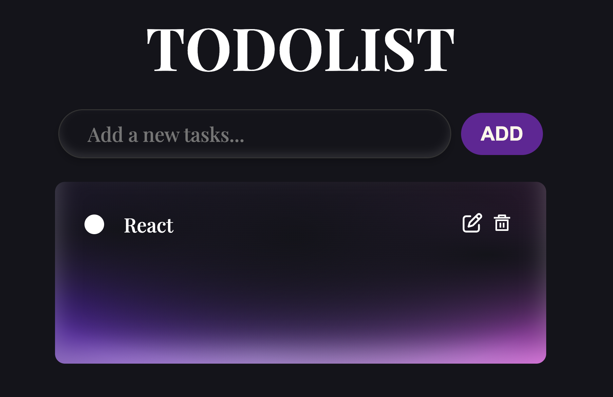

# todolist-react

## 專案簡介

使用 React Hooks 製作的待辦清單應用程式，支援新增、刪除、編輯、完成待辦事項，並利用 localStorage 儲存清單，確保頁面重新整理後資料不會遺失。

## 功能列表

- 新增：輸入待辦事項後按下「ADD」按鈕，將項目加入清單。
- 完成：勾選項目前的確認框，將待辦劃掉表示已完成。
- 編輯：點選編輯按鈕即可修改該項內容。
- 刪除：點選垃圾桶圖示刪除該項目。
- 資料保存：透過 localStorage 保存清單，頁面重新整理後仍可保留資料。

## 使用技術

- React (React Hooks)
- HTML5 / CSS3
- JavaScript (ES6+)

## 專案畫面



## 安裝與執行

### 前置需求

- Node.js (建議版本 16+)
- npm（隨 Node.js 一起安裝）

### 安裝套件

```bash
npm install
```

### 啟動開發環境

```bash
npm run dev
```

## 部署網址

## 授權

此專案僅作為學習與展示用途。
